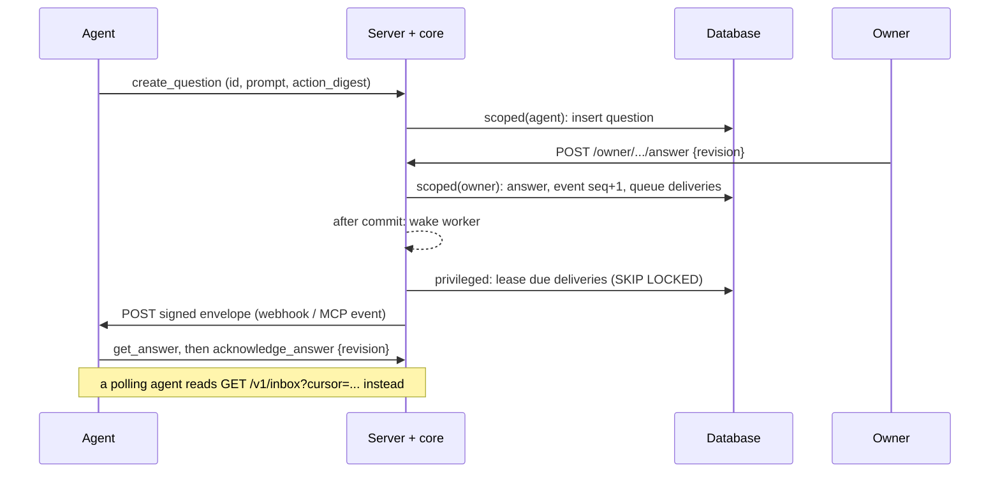

# Architecture

This document explains how the pieces fit together: the packages, the data
model, what happens on each request, and how events reach agents. The exact
wire format is in the [contract](contract.md); the security reasoning is in
the [threat model](security/threat-model.md).

## Principals

| Principal | Who | Authenticates with | Can |
| --- | --- | --- | --- |
| Agent | One connected AI agent (or one OAuth client) | Agent credential, or OAuth access token on `/mcp` | Read and write only its own connection's rows, within its scopes |
| Owner | The person who connects agents and answers them | Owner credential (`/owner/*`, consent form) | Everything across their own connections |
| System | The server itself: credential lookup, setup-code claims, OAuth registration, authorization and exchange, delivery worker, sweeps | Runs `privileged()` transactions | Work that is cross-tenant by nature |

A **connection** is the unit of isolation: one per agent, with a `provider`
(e.g. `my_shell_agent`), a `display_name`, a `mode` (`mcp_webhook`,
`oauth_events`, `cli_poll`), a scope set and a status (`pending` until the
first credential, `active`, `revoked`). Two agents of the same owner are two
connections and cannot see each other's rows.

## Packages

```text
packages/core       @agent-aggregator/core       no runtime dependencies; TypeScript → dist/
  contract.ts       wire types, LIMITS, SCOPES, event names, CONTRACT_VERSION
  validate.ts       text normalization, id/timestamp/JSON validation
  errors.ts         AggregatorError: code → HTTP status, response-safe messages
  secrets.ts        tokens, digests, hints, setup codes, AES-256-GCM SecretBox
  webhooks.ts       Standard Webhooks sign/verify, whsec_ secrets
  url-guard.ts      SSRF-safe outbound requests (validate, resolve, pin, bound)
  cursor.ts         opaque inbox cursors
  db.ts             SqlDriver seam: scoped(scope) / privileged(), SQL dialect translation
  schema.ts         Postgres DDL (roles, RLS, composite FKs, version marker) and SQLite DDL
  stores/postgres   driver over a postgres.js client: SET LOCAL ROLE + transaction-local principal
  stores/sqlite     driver over node:sqlite: serialized transactions, single owner
  service.ts        AggregatorService: every agent, owner and privileged operation
  oauth.ts          PKCE, RFC 8414/9728 metadata, authorize validation, CIMD, DCR, challenges
  mcp.ts            dual-era MCP over Streamable HTTP, TOOL_DEFINITIONS, EVENT_DEFINITIONS
  rest.ts           framework-free agent REST handler
  client.ts, cli.ts typed REST client and the deterministic agent CLI (runAgentCli)
  setup-prompts.ts  setup playbook an owner gives an agent, per wake mode (no secrets)
  rate-limit.ts     in-memory fixed-window limiter, default budgets, route → bucket

packages/server     @agent-aggregator/server     depends on core and postgres (postgres.js)
  app.ts            node:http server, routing, request logs, delivery loop start/stop
  agent-routes.ts   /api/v1/* → core REST handler; /mcp → core MCP handler; audiences
  oauth-routes.ts   metadata, /oauth/authorize (consent page + form), token, register, revoke
  consent.ts        server-rendered consent HTML, CSP, escaping
  owner-routes.ts   /owner/* route table (OWNER_ROUTES)
  owners.ts         owner records and owner credentials
  limits.ts         per-connection and per-IP rate limits, failed-auth blocking
  worker.ts         deliverDue() every 2 s, sweep() every 60 s
  storage.ts        opens SQLite or Postgres, migrate, revoked roles
  doctor.ts         read-only isolation checks (agg-server doctor)
  owner-cli.ts      agg-owner
  bin/agg-server.ts start | keygen | migrate | doctor

packages/agent-cli  @agent-aggregator/agent-cli  bin/agg.js: runAgentCli with AGG_* defaults
scripts/            poll-inbox.sh, install-poller.sh (POSIX sh + curl), gen-contract-docs.mjs
examples/           model-free clients for each wake mode; run-demo.mjs
```

The core never opens a socket on its own except through the SSRF guard, and
never imports a database driver: the Postgres driver takes a postgres.js
client you pass in, and the SQLite driver uses Node's built-in `node:sqlite`.
That keeps the core embeddable in another product with its own HTTP framework,
database pool and owner accounts (`ownerReference` points the schema at an
existing users table).

## Data model

All tables share a prefix (`aggregator_` by default).

| Table | Rows | Key points |
| --- | --- | --- |
| `owners` | People | `secret_hash`: SHA-256 of the owner credential (reference server) |
| `connections` | One per agent | `status`, `scopes`, `event_seq` (per-connection event counter), `UNIQUE (id, owner_id)` |
| `credentials` | Agent credentials, OAuth access/refresh tokens, setup codes | Only `secret_hash` and a short `hint`; `family_id` groups OAuth tokens from one authorization |
| `work_items` | Tasks, goals, projects, states | `PRIMARY KEY (connection_id, id)`: ids are the agent's own |
| `checkpoints` | Append-only progress notes | Idempotent by id |
| `questions` | Questions and approvals | `revision`, `action_digest`, `answer` (JSON), `acknowledged_at` |
| `jobs` | Handoffs | `status`, `status_reason`, `UNIQUE (connection_id, idempotency_key)` |
| `events` | The inbox | `PRIMARY KEY (connection_id, seq)`; `id` is the event id |
| `destinations` | Webhook (one per connection) and MCP event subscriptions | `signing_secret_enc`, `auth_header_value_enc`: encrypted |
| `deliveries` | One per (destination, event) | `status`, `attempts`, `next_attempt_at` |
| `threads` | Conversations between the owner and one connection | `UNIQUE (connection_id, ref)`: `ref` is the host's conversation id; `message_seq` orders its messages |
| `messages` | Owner → agent and agent → owner messages | `body_enc`: encrypted; `status` (`queued` → `delivered` → `working` → `replied`, or `failed`); `UNIQUE (connection_id, direction, client_id)` for idempotent sends and posts |
| `audit` | Who did what | `actor` is `agent`, `owner` or `system` |
| `oauth_clients` | DCR and CIMD clients | Service-only |
| `oauth_requests` | Pending authorizations and issued codes | `code_hash`, single-use status |

Every child table except `audit` carries `(owner_id, connection_id)` with a
composite foreign key to `connections (id, owner_id)` and `ON DELETE CASCADE`
(deliveries additionally reference `destinations (id, connection_id)`,
messages `threads (id, connection_id)`). A row
can therefore never claim one owner while pointing at another owner's
connection, and deleting a connection removes everything it produced. Audit
rows have no foreign key so the record of a deletion can outlive the
connection: `deleteConnection` removes the connection's audit rows explicitly
and then writes one `connection.delete` entry.

## Isolation: scoped() and privileged()

The service never runs SQL outside one of two driver methods:

- `scoped({role: "agent", ownerId, connectionId}, fn)` for every agent call,
  and `scoped({role: "owner", ownerId}, fn)` for every owner call;
- `privileged(fn)` only for work that has no single owner yet or spans all
  owners: credential lookup, setup-code claims, OAuth client registration and
  the client-metadata cache, authorization requests (create, read, approve,
  deny), code and refresh exchange, token revocation, the delivery worker and
  sweeps; in the reference server also owner authentication and rotation
  (`owners.ts`) and the `/healthz` round trip.

On Postgres a scoped transaction does:

```sql
BEGIN;
SELECT set_config('aggregator.owner_id', $1, true),        -- transaction-local
       set_config('aggregator.connection_id', $2, true),
       set_config('statement_timeout', $3, true);
SET LOCAL ROLE aggregator_agent;                           -- or aggregator_owner
-- service queries ...
COMMIT;
```

`aggregator_agent` and `aggregator_owner` are `NOLOGIN` roles without
`BYPASSRLS`. On PostgreSQL 16+ the API role holds a `SET`-only membership in
them (on older versions a plain `GRANT`; a superuser needs none). Every table
has row-level security enabled and **forced**, with
policies such as `owner_id = aggregator_ctx_owner() AND connection_id =
aggregator_ctx_connection()` for agents and `owner_id = aggregator_ctx_owner()`
for owners. Grants keep agents from reading credential rows or encrypted
secrets at all (they may write a destination's encrypted columns when setting
their own webhook), and let an agent update only `event_seq`, `last_seen_at`
and `updated_at` on its own connection row (never its scopes or status) and
listed columns of its questions and jobs. The `BEFORE UPDATE` triggers
`aggregator_questions_agent_guard` and `aggregator_jobs_agent_guard` (functions
`aggregator_guard_agent_question`, `aggregator_guard_agent_job`) go further:
under the agent role a question may only be revised or withdrawn while
pending, or have its answer acknowledged, and a job may only be cancelled
while open; answering, approving and every other transition are the owner's.
So a query that forgot its
`WHERE connection_id = ...` still returns only the caller's rows, and a
missing principal returns nothing. `privileged()` runs as the connecting role,
which therefore needs `BYPASSRLS` ([storage](storage.md#why-the-api-role-needs-bypassrls-and-createrole)).

SQLite has no roles or RLS: the same service predicates apply, and SQLite is
intended for one owner on one machine.

## A request, end to end

`agg ask --id q1 --prompt "Ship it?"` from an agent with a shell:

1. The CLI sends `POST /api/v1/questions` with `Authorization: Bearer agg_...`
   and `User-Agent: agent-aggregator-cli/0.1.0`.
2. The server checks the per-IP failed-authentication block, reads at most
   256 KiB, parses JSON, and passes `/v1/questions` to the core REST handler.
3. `authenticate` hashes the credential and looks the digest up in a
   privileged transaction (revoked, expired or disconnected credentials
   resolve to nothing). REST accepts only agent credentials.
4. `beforeCall` charges the connection's `question` budget (60 per hour).
5. `createQuestion` checks the `hub:ask` scope, validates and normalizes every
   field, then in a scoped agent transaction inserts the question (or returns
   the existing one for an identical retry) and writes an audit entry.
6. The response is `201 {question, created: true, revised: false}`. The
   request log line has method, path, route, status, duration and IP only.

## Events and delivery

When an event is due (the owner answers, dismisses a question, decides a
job, reports progress or sends a message; a sweep expires a question; an
agent creates a handoff), the service, in the same transaction:

1. increments `connections.event_seq` (the row update serializes concurrent
   writers on that connection, so sequence numbers have no gaps and commit in
   order),
2. inserts the event with that `seq`,
3. inserts one `deliveries` row per matching destination (the webhook gets
   every event; subscriptions match by event name and `arguments` filter).

After commit, the `deliveriesQueued` hook wakes the server's worker. The
worker (every 2 s, or immediately when woken):

1. leases due deliveries in a privileged transaction with
   `FOR UPDATE SKIP LOCKED` (safe with several workers) and pushes their
   `next_attempt_at` 120 s ahead,
2. decrypts the destination's signing secret and routine key,
3. signs the envelope with Standard Webhooks headers and sends it with the
   SSRF-guarded client,
4. records `delivered`, schedules a retry with backoff, or marks it failed.

An owner message (`message.created`) also moves to `delivered` when a
delivery of it succeeds or the agent reads it from the inbox, and the
`messageStatusChanged` hook reports that after commit
([conversations](conversations.md)).

Every 60 s the sweep expires due questions (emitting `question.updated`),
fails owner messages nobody picked up (20 minutes) or answered (120 minutes),
and prunes: delivered/failed deliveries and events older than 30 days
(events with a pending delivery are kept); checkpoints and audit entries
older than 180 days; expired subscriptions; OAuth requests a day after they
expired (pending, denied, exchanged; an approved request whose code was never
exchanged is kept);
credentials 7 days after they expired, were revoked or (setup codes and
refresh tokens) were used; and OAuth client registrations that no request
or live credential uses, one day after registration.



## OAuth flow

For `oauth_events` connections the server is its own authorization server:

1. The client calls `/mcp` without a token and gets 401 with
   `WWW-Authenticate: Bearer resource_metadata=".../.well-known/oauth-protected-resource/mcp"`.
2. It reads the protected resource metadata, then the authorization server
   metadata, and registers (`/oauth/register`) or uses a client ID metadata
   document URL as its `client_id`.
3. It opens `/oauth/authorize` with PKCE S256. The server validates the
   client and redirect URI (failures here are shown, never redirected),
   stores an authorization request and redirects to the consent page.
4. The owner reviews the client name (marked as self-declared), the host that
   receives the code, and the scopes, types the owner credential and approves.
   The form is protected by a CSRF token bound to the request and a
   `SameSite=Strict` cookie; the page sends a strict CSP and cannot be framed.
5. The server creates (or re-links) an `oauth_events` connection, mints a
   single-use code and redirects with `code`, `state` and `iss`.
6. The client exchanges the code with its verifier for an access token (1 h,
   audience `<AGG_PUBLIC_URL>/mcp`) and a refresh token (60 days, rotated on
   every use). Replaying a code or a used refresh token revokes the family.

## Deployment shapes

| Shape | Storage | Notes |
| --- | --- | --- |
| One person, one machine | SQLite file (`./data/aggregator.db`, mode 0600) | `AGG_HOST=127.0.0.1` (default). Webhook/OAuth callers must reach it, e.g. through a tunnel with `AGG_PUBLIC_URL` set to the tunnel's https URL. |
| Self-hosted service | Postgres you run | TLS-terminating reverse proxy in front, `AGG_PUBLIC_URL=https://...`, `AGG_TRUST_PROXY=1` |
| Your own Supabase project | Supabase Postgres | [deploy on Supabase](playbooks/deploy-supabase.md) |
| Embedded in another product | Any Postgres, `ownerReference` to your users table | Use the core directly with your framework; reuse the playbooks' checks |

The reference server is a single process: rate limits are in memory and the
worker runs in-process. Several instances can share one Postgres database
(deliveries are leased with `SKIP LOCKED`), but each instance then enforces
its own rate limits.
