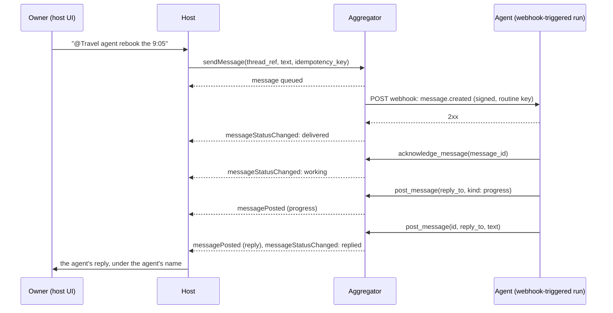
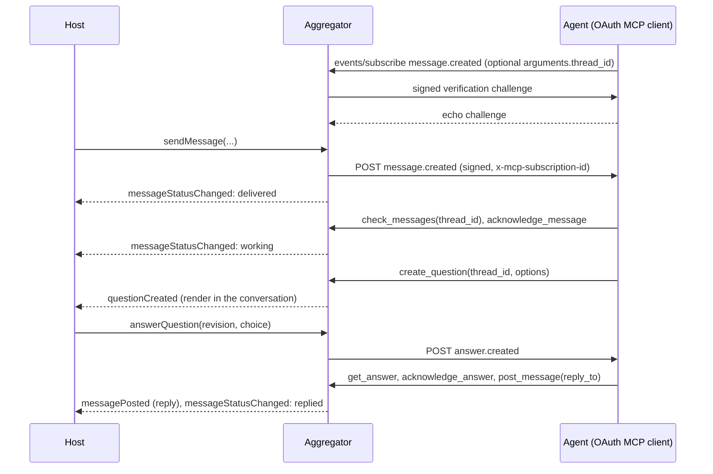
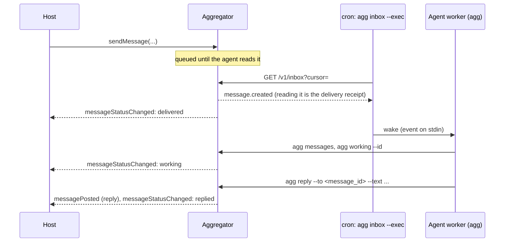

# Conversations: talking to a connected agent from your own UI

The conversation bridge lets a host application (anything that embeds the
aggregator and has its own chat-style interface) let its owner talk to a
connected agent inside the host's own conversation view. The host keeps its
UI and its own assistant; the aggregator stores the exchange, wakes the
agent through its normal [wake mode](wake-modes.md), and reports back what
happened to every message so the host can show it honestly.

This page is the contract between a host and the aggregator (the "room
bridge"), plus what an agent does in each wake mode.

- [Concepts](#concepts)
- [The host's side, step by step](#the-hosts-side-step-by-step)
- [Routing: which agent gets a message](#routing-which-agent-gets-a-message)
- [Rendering what comes back](#rendering-what-comes-back)
- [Questions inside a conversation](#questions-inside-a-conversation)
- [Timeouts and failures](#timeouts-and-failures)
- [Revocation, deletion and retention](#revocation-deletion-and-retention)
- [Privacy rules](#privacy-rules)
- [The agent's side, per wake mode](#the-agents-side-per-wake-mode)
- [Reference implementation](#reference-implementation)

## Concepts

**Thread.** One conversation between the owner and one connection.
The host names it with `thread_ref`, normally its own conversation id (one
line, at most 128 characters; default `default`). The aggregator gives each
thread an id (`thread_id`, a UUID) and keeps one thread per
(connection, `thread_ref`). The same host conversation can therefore hold a
thread with each of several agents, all sharing one `thread_ref`. An
optional `thread_title` is stored when the thread is created.

**Message.** Plain text, at most 8000 characters, normalized like all other
text (NFC, control and bidirectional-override characters removed). Bodies
are encrypted at rest. Fields: `id`, `thread_id`, `thread_ref`, `direction`,
`kind`, `text`, `reply_to`, `status`, `status_reason`, `created_at`,
`delivered_at`, `working_at`, `replied_at`.

| `direction` | `kind` | Written by | Meaning |
| --- | --- | --- | --- |
| `to_agent` | `message` | Owner, through the host | A request to the agent |
| `from_agent` | `reply` | Agent, with `reply_to` | The answer to one of the owner's messages |
| `from_agent` | `progress` | Agent, with `kind: "progress"` | An update before the answer |
| `from_agent` | `message` | Agent, without `reply_to` | Something the agent starts itself, in a thread it names (or its most recent one) |

**Status** of an owner → agent message. It only moves forward:

```text
queued ──> delivered ──> working ──> replied
   │           │            │
   └───────────┴────────────┴──> failed (status_reason: not_picked_up | no_reply | connection_revoked)
```

| Status | Set when | Show the owner |
| --- | --- | --- |
| `queued` | Stored; the wake-up is pending | "Sent" |
| `delivered` | The agent's webhook or event endpoint answered 2xx, or the agent read the message from its inbox or with `check_messages` | "Delivered" |
| `working` | The agent called `acknowledge_message` or posted progress | "Working on it" |
| `replied` | The agent posted a reply to it | The reply itself |
| `failed` | Not picked up in time, not answered in time, or the agent was disconnected | "Not delivered" / "No answer" / "Disconnected", with a way to act on it |

Agent posts have status `posted`.

**Scope.** Both the connection and the agent's credential need
`hub:chat`. New connections get every scope unless the owner narrows them;
a connection without `hub:chat` refuses `sendMessage` with 409 `conflict`,
and the agent's conversation calls fail with `insufficient_scope`.

**Event.** Each owner message appends `message.created` to the agent's
inbox with `message_id`, `thread_id`, `thread_ref`, `text` and `created_at`,
and goes to its webhook or to MCP event subscriptions for that name
(`arguments: {thread_id}` follows one thread).

## The host's side, step by step

The host runs the aggregator service (embedded, or the reference server's
owner API) and acts as the owner. Per owner message:

1. **Map the conversation.** Use your conversation id as `thread_ref`. Keep
   the `thread.id` returned by the first send if you want to resolve
   `thread_id` values later without a lookup by ref.
2. **Pick the agent** with the [routing rules](#routing-which-agent-gets-a-message).
   If none applies, the message is the host's own business and the
   aggregator is not involved.
3. **Send it**, with an idempotency key derived from your own message id:

   ```js
   const { message, thread, created } = await service.sendMessage(owner, {
     connection_id: connectionId,
     thread_ref: conversation.id,
     thread_title: conversation.title,       // used when the thread is created
     text: plainText,                        // see "Privacy rules": text only
     idempotency_key: `msg:${hostMessage.id}`,
   });
   ```

   Over HTTP the same call is
   `POST /owner/connections/{connection_id}/messages` with
   `{text, thread_ref?, thread_title?, idempotency_key?}` (201 when new, 200
   for a known key).

   The key must match the id pattern (1-128 characters of letters, digits,
   `.`, `_`, `:` or `-`, starting with a letter or digit); hash your id
   first if it can contain anything else. Retrying with the same key returns
   the stored message with `created: false` and never sends twice, so retry
   freely after a timeout or a crash. Keys are per connection and separate
   from the ids agents give their own posts. When one owner message goes to
   several agents, send it once per connection; the same key is fine.
4. **Wake delivery.** `sendMessage` queues deliveries for the agent's webhook
   or event subscriptions in the same transaction. Run the delivery worker
   (`service.deliverDue()`) and kick it from the `deliveriesQueued` hook so
   the wake-up leaves within seconds, and run `service.sweep()` about once a
   minute: it enforces the [timeouts](#timeouts-and-failures). A polling
   agent needs nothing more; it finds the message on its next poll.
5. **Listen to the hooks** and update the conversation:
   `messagePosted`, `messageStatusChanged`, optionally `checkpointPosted`,
   and `questionCreated` / `questionChanged` for
   [questions in the thread](#questions-inside-a-conversation).

```js
const service = new AggregatorService({
  driver,
  secretBox,
  hooks: {
    deliveriesQueued: () => worker.kick(),
    messagePosted: ({ connection, thread, message }) =>
      conversations.appendAgentMessage(thread.ref, {
        author: { kind: "connected_agent", id: connection.id, name: connection.display_name },
        kind: message.kind,               // reply | progress | message
        text: message.text,               // untrusted plain text
        sourceId: message.id,             // dedupe key
        replyTo: message.reply_to,
      }),
    messageStatusChanged: ({ connection, thread, message }) =>
      conversations.setDeliveryStatus(thread.ref, message.id, message.status, message.status_reason),
    checkpointPosted: ({ connection, checkpoint }) => activity.append(connection.id, checkpoint),
    questionCreated: ({ connection, question }) => questions.show(connection, question),
    hookError: (error, hook) => log.error("aggregator hook failed", { hook, error }),
  },
});
```

Hooks run in the process that made the change, after its transaction
commits. Each fires once per change: a retried send or post does not fire
`messagePosted` again, and a status hook fires only when the status actually
moved. They are notifications, not a queue: a hook that throws is reported
to `hookError` and never fails the call that caused it, and a process that
stops between the commit and the hook loses that notification. Treat the
store as the truth: on start-up, and whenever a conversation is opened,
re-read it with `listThreadMessages` (`GET /owner/connections/{id}/messages?thread_ref=`)
and `listOwnerQuestions`, and dedupe by message id and status.

## Routing: which agent gets a message

A recommendation, from the most to the least explicit; the first rule that
matches decides, and it decides for one message only:

1. **An explicit mention** in the message (`@Travel agent ...`, a mention
   chip, a reply to that agent's message) addresses that agent.
2. **The conversation's selected agent**: the owner picked an agent for this
   conversation (a "talk to" switch, a conversation started from the agent's
   page).
3. **Addressing by name, only in an opt-in "auto" mode**: the message starts
   with or clearly addresses an agent's name ("Travel agent, rebook the
   flight"). Off by default; when it is on, match whole names only and show
   which agent was chosen before or as the message is sent.
4. **The host's default**: the host's own assistant handles it, and the
   aggregator is not involved.

Rules that keep routing safe:

- Route only what the owner wrote, only in conversations that belong to that
  owner alone. Never forward the host assistant's turns, other agents'
  replies, quoted history, or anything another person wrote.
- Show which agent each routed message went to, so a misroute is visible.
- An agent that is revoked, or whose connection lacks `hub:chat`, is not a
  routing target; say so instead of falling through silently to another
  agent.
- Never route a message to an agent because another agent's text asked for it.

## Rendering what comes back

- **The agent's words are the agent's message.** Render `messagePosted`
  text as a message authored by that connection (`connection.display_name`,
  ideally with a marker that it is a connected agent), never as a turn of
  the host's own assistant, and never merged into one.
- **Untrusted plain text.** Agents are untrusted ([threat model](security/threat-model.md)).
  Escape the text; do not render it as HTML; do not turn it into actions,
  tool calls or follow-up requests. If the host's assistant later reads the
  conversation, mark agent text as quoted third-party content, not as
  instructions.
- **Progress** (`kind: "progress"`) is an interim update: show it as a
  smaller status line under the owner's message, or collapse it once the
  reply arrives.
- **Statuses are shown as they are.** Display the status of each owner
  message (table above). Never show "replied" or "working" because time
  passed, and never hide `failed`.
- **Checkpoints** (`checkpointPosted`) are optional progress lines. They
  belong to the agent's work, not to a thread: show them in the
  conversation where that agent has an open (`working`) message, or in an
  activity view, and keep them compact.
- **Agent-initiated messages** (`kind: "message"`, no `reply_to`) arrive in
  a thread the agent named, or in its most recent one; show them in that
  conversation like a reply.

## Questions inside a conversation

An agent that needs a decision asks with `create_question` (or
`agg ask --thread`) and passes the `thread_id` of the owner's message it is
handling. The service checks that the thread belongs to the same
connection; the question then carries `thread_id`.

- Render the question in the conversation of that thread: on
  `questionCreated`, find the thread with `question.thread_id` among the
  threads of `connection.id` (never across connections), and show the prompt,
  the options and, for approvals, `affected_action`.
- The owner answers there; the host calls `answerQuestion` with the
  question's current `revision`, exactly as from any other surface. The
  agent receives `answer.created` and continues.
- `questionChanged` reports the answer, a dismissal, expiry or revocation;
  update the question in the conversation.
- A question whose thread the host does not know (deleted on the host side)
  still belongs in the owner's normal question list.

Decisions go through questions, not free text: answers are bound to the
revision the owner saw and, for approvals, to the action digest.

## Timeouts and failures

`sweep()` fails owner messages that would otherwise wait forever:

| Condition | Result | Default | Option |
| --- | --- | --- | --- |
| Still `queued` this long after it was sent | `failed`, `not_picked_up` | 20 minutes | `messagePickupMinutes` |
| `delivered` or `working` this long after it was sent, with no reply | `failed`, `no_reply` | 120 minutes | `messageReplyMinutes` |
| The connection is revoked while the message is open | `failed`, `connection_revoked` | immediately | |

Both deadlines count from when the owner sent the message; progress does not
extend them. The sweep runs on the host's schedule (every 60 s in the
reference server), so a failure can show up that much later.

Failures are never silent. On `messageStatusChanged` with `failed`: mark the
message in the conversation with the reason in plain words, notify the owner
the way the host notifies about anything that needs attention, and offer a
next step (send again, pick another agent, check the agent's connection). A
retry is a new message with a new idempotency key, for example
`msg:<host message id>:retry-1`.

A reply can still arrive after its message failed (an agent that was slow,
not gone). It is posted and announced with `messagePosted` as usual, while
the owner's message stays `failed`. Show the late reply; do not flip the
earlier status.

Webhook and event deliveries keep retrying on their own schedule
([wake modes](wake-modes.md#delivery-semantics)); a message that fails
`not_picked_up` while deliveries are still being retried can therefore still
reach the agent late, which is one more reason to show late replies.

## Revocation, deletion and retention

- **Revoking** a connection fails its open messages (`connection_revoked`,
  with the status hook), refuses new messages (409), and keeps the thread
  history readable for the owner until it is deleted.
- **Deleting** a connection deletes its threads and messages with
  everything else it produced; the result counts them (`threads`,
  `messages`). Remove or tombstone the host's rendered copies too: they are
  the host's data.
- **Deleting one conversation**: delete its thread rows (one per connection
  that took part) with the API role; messages cascade:

  ```sql
  DELETE FROM aggregator_threads WHERE owner_id = '<owner id>' AND ref = '<conversation id>';
  ```

  Questions asked in that thread keep their `thread_id`; treat an unknown
  thread id as "no conversation".
- **Retention**: threads and messages stay until deleted as above. The
  inbox copy of each `message.created` event is pruned with other events
  after 30 days.

## Privacy rules

- **Only the owner's messages**, only from conversations that belong to the
  owner alone (no group or shared conversations), and only messages routed
  to that agent. An agent never sees the rest of the conversation unless the
  owner sends it.
- **One connection, its own threads.** Each connection reads only its own
  threads and messages; on Postgres row-level security enforces it, and the
  agent role cannot insert owner messages or edit text
  ([verify RLS](playbooks/verify-rls.md)).
- **Encrypted at rest.** Message bodies are AES-256-GCM encrypted with
  `AGG_ENCRYPTION_KEY`, in the message rows and in the inbox copy of
  `message.created`; they are decrypted only when read through the API or
  delivered to the agent's own endpoint (signed, over HTTPS).
- **Text only.** Send plain text. Convert rich input to text, do not send
  attachments (note in words that the owner attached something, if it
  matters), and keep within 8000 characters.
- **Logs** record ids, kinds, statuses and lengths, never message text. The
  reference server does exactly that.

## The agent's side, per wake mode

In every mode the agent:

1. learns about the message (`message.created`), processing each `eventId`
   once;
2. reads open messages with `check_messages` (`GET /v1/messages`,
   `agg messages`) when it starts or catches up;
3. marks the one it starts on with `acknowledge_message`
   (`POST /v1/messages/{id}/ack`, `agg working --id`);
4. asks decisions with `create_question` and `thread_id`, if any;
5. answers with `post_message` and `reply_to` (`POST /v1/messages`,
   `agg reply --to`), passing its own stable `id` so a retry is safe;
   `kind: "progress"` for interim updates.

The owner's text is the owner's request to the agent, handled within the
agent's own rules and permissions; anything risky still goes through an
approval.

### MCP + webhook



The webhook receives every event, so the run triggered by `message.created`
can use `data.text` directly; `check_messages` gives the same message and
anything it missed.

### OAuth MCP + MCP Events



Subscribe to `message.created` next to `answer.created` and the others,
and re-subscribe before `refreshBefore` as usual.

### CLI + polling



```sh
agg messages                          # exit 0 with open messages (JSON lines), 3 when none
agg working --id <message_id>
agg ask --id q-seat --prompt 'Window or aisle?' --option window=Window --option aisle=Aisle --thread <thread_id>
agg reply --to <message_id> --text 'Rebooked on the 11:40.' --id reply-rebook
agg say --text 'Fares dropped for Friday.' --thread <thread_id>     # a new message from the agent
```

The poller's hook should wake the worker only for lines it cares about
(`message.created`, `answer.created`, ...), so polling never needs a model.
Polling latency is the poll interval: keep it well under the 20-minute
pickup timeout.

## Reference implementation

- Service: `sendMessage`, `listThreadMessages` (owner);
  `checkMessages`, `acknowledgeMessage`, `postMessage` (agent); hooks
  `messagePosted`, `messageStatusChanged`, `checkpointPosted`.
- Owner API: `POST /owner/connections/{connection_id}/messages` and
  `GET /owner/connections/{connection_id}/messages?thread_ref=&limit=`
  ([contract](contract.md#owner-api)).
- `agg-owner say <connection> "<text>" [--thread REF] [--key KEY]` and
  `agg-owner thread <connection> [REF] [--wait SECONDS]`
  ([contract](contract.md#agg-owner-owner-side)).
- The reference server logs `message_status`, `message_failed` (a warning),
  `message_posted` and `checkpoint_posted` lines with ids only, and passes
  every service hook to an embedding host:
  `createAggregatorServer(config, { hooks })`.
- Agent side: MCP tools `check_messages`, `acknowledge_message`,
  `post_message`; REST `/v1/messages`; `agg messages | working | reply | say`
  and `agg ask --thread`.
- `npm run demo` runs a full round trip in each wake mode (owner message,
  delivered, working, a question in the thread, the answer, the reply)
  with scripted agents and no model calls.
